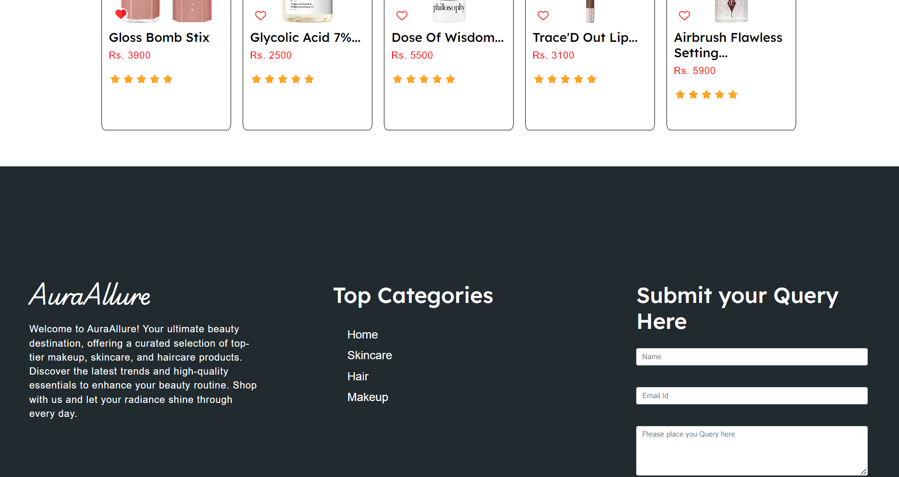
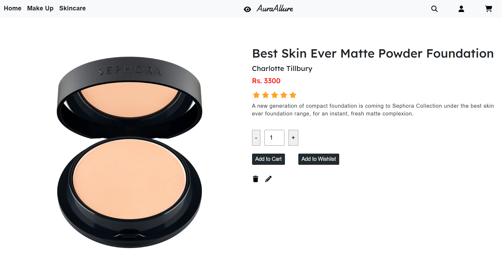
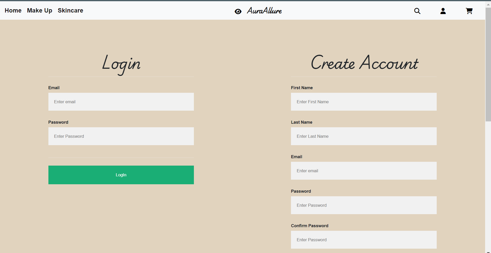
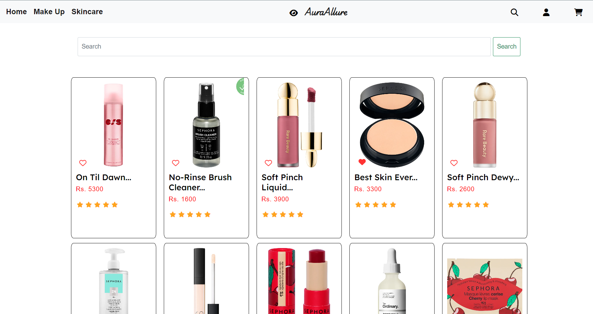
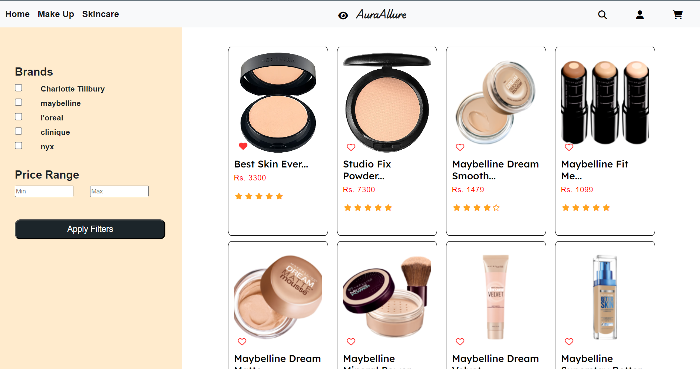
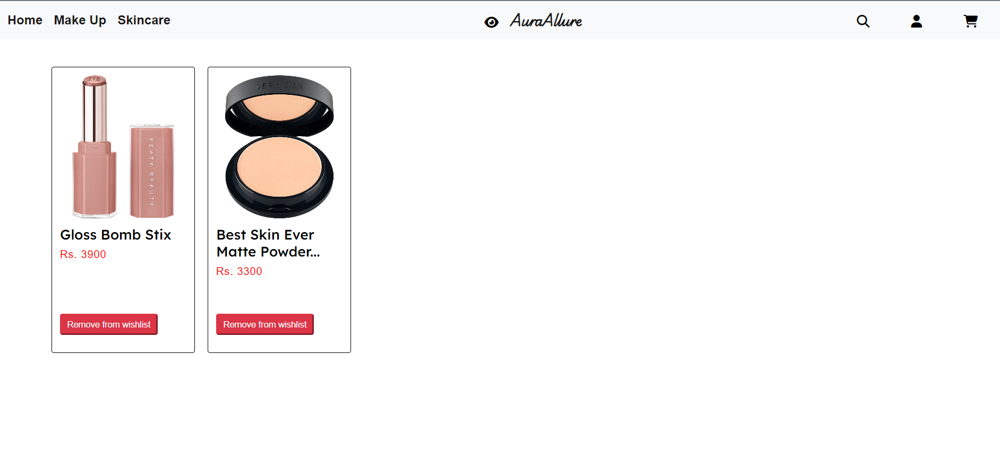
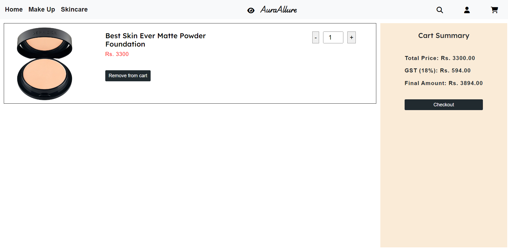
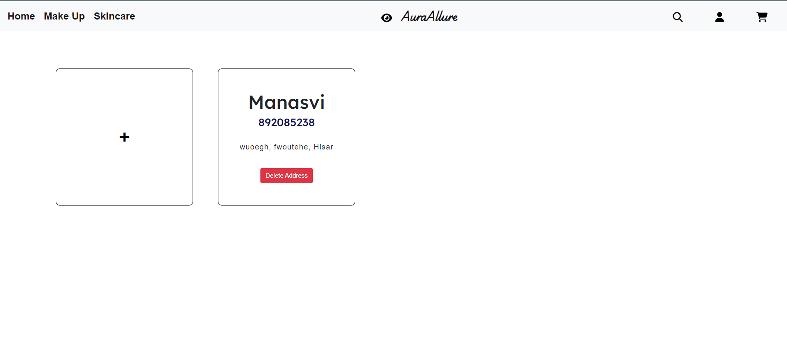
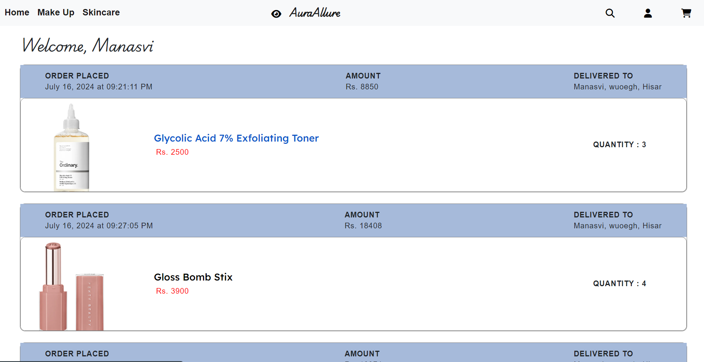
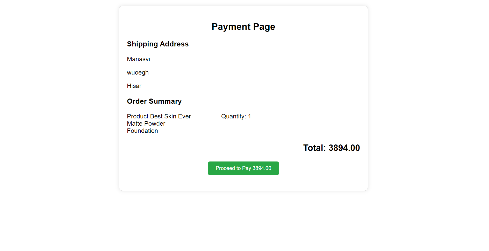

# Aura Allure

Aura Allure is an eCommerce web application for beauty products. Users can browse products, add them to their cart or wishlist, and purchase them. The platform includes user authentication, order management, and an admin panel for managing products and orders.

## Live Hosting
    ```
    https://aura-allure-ecommere.vercel.app/
    ```

## Getting Started

### Prerequisites

- **Node.js** - Download and install Node.js from [https://nodejs.org/en/download/](https://nodejs.org/en/download/)
- **MongoDB** - Download and install MongoDB from [https://www.mongodb.com/download-center/community](https://www.mongodb.com/download-center/community)

### Installing

1. Clone the repository

    ```sh
    git clone https://github.com/YourUsername/AuraAllure.git
    ```

2. Install dependencies

    ```sh
    npm install
    ```

3. Create a `.env` file in the root directory and add your environment variables

    ```env
    PORT=3000
    MONGODB_URL=your_mongodb_connection_string
    JWT_SECRET=your_secret_key
    ```

4. Start the server

    ```sh
    npm start
    ```

5. Open [http://localhost:3000](http://localhost:3000) in your browser

## Built With

- [Node.js](https://nodejs.org/en/) - JavaScript runtime
- [Express](https://expressjs.com/) - Web framework
- [MongoDB](https://www.mongodb.com/) - Database
- [Mongoose](https://mongoosejs.com/) - MongoDB object modeling tool
- [Handlebars](https://handlebarsjs.com/) - Templating engine

## Extra Packages Used

- `dotenv` - Loads environment variables from a `.env` file into `process.env`
- `bcrypt` - Library for hashing passwords
- `cookie-parser` - Middleware to parse cookies
- `jsonwebtoken` - Library to work with JSON Web Tokens
- `method-override` - Middleware to use HTTP verbs such as PUT or DELETE in places where the client doesn't support it

## Functionalities

- User authentication (signup, login, logout)
- User authorization
- Search products (search, navigate, filters)
- Product management (add, edit, delete products)
- Cart management (add, remove products from cart)
- Wishlist management (add, remove products from wishlist)
- Order management (place orders, view order history)
- Address management (add new address, store address)
- Admin panel for managing products, orders and users

## Folder Structure

```
.
├── index.js
├── templates
│   ├── views
│   │   ├── account-details.hbs
│   │   ├── addAddress.hbs
│   │   ├── address.hbs
│   │   ├── cart.hbs
│   │   ├── checkout.hbs
│   │   ├── deleteAdmin.hbs
│   │   ├── deleteUserAdmin.hbs
│   │   ├── editAdmin.hbs
│   │   ├── index.hbs
│   │   ├── indexAdmin.hbs
│   │   ├── newProductAdmin.hbs
│   │   ├── orderHistory.hbs
│   │   ├── payment.hbs
│   │   ├── productDetails.hbs
│   │   ├── products.hbs
│   │   ├── register.hbs
│   │   ├── search.hbs
│   │   └── wishlist.hbs
│   ├── partials
│   │   ├── card.hbs
│   │   ├── footer.hbs
│   │   ├── header.hbs
│   │   ├── navbar.hbs
│   │   ├── wishlistCard.hbs
│   │   └── script.hbs
├── src
│   ├── db
│   │   ├── conn.js
│   ├── middleware
│   │   ├── auth.js
│   ├── models
│   │   ├── Address.js
│   │   ├── Cart.js
│   │   ├── order.js
│   │   ├── Product.js
│   │   ├── query.js
│   │   └── User.js
├── package.json
├── package-lock.json
├── public
│   ├── css
│   │   ├── account.css
│   │   ├── cart.css
│   │   ├── checkout.css
│   │   ├── newProduct.css
│   │   ├── productDetails.css
│   │   ├── products.css
│   │   ├── register.css
│   │   ├── search.css
│   │   └── style.css
│   ├── images
│   │   ├── indexcar1.png
│   │   ├── indexcar2.png
│   │   ├── indexcar3.png
│   │   ├── indexlatest1.png
│   │   ├── indexlatest2.png
│   │   └── indexlatest3.png
├── README.md

```


## Demo

### Home Page




### Product Page



### Login Page



### Search Page



### Search Result Page



### WishList Page



### Cart Page



### Address Page



### Order History Page



### Payment Page




## Contribution

1. Contributions are welcome! Please feel free to submit a Pull Request.
2. Please create an issue for any new feature requests/bugs.
3. Pull requests will be merged after being reviewed.

